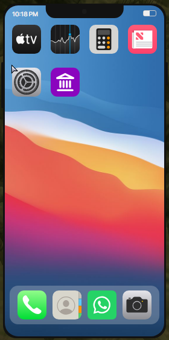
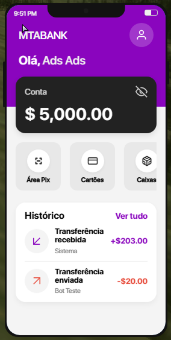
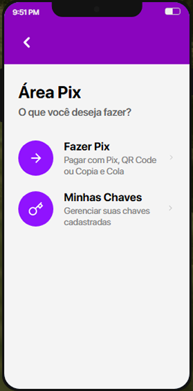
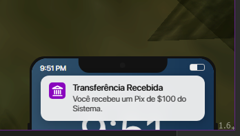

# Smartphone MTA


Sistema de Smartphone totalmente open source e com atualizações constantes para servidores de Multi Theft Auto (MTA:SA).

## 📸 Demonstração

Aqui estão algumas imagens do sistema em funcionamento:

### Tela Inicial


### Sistema Bancário



### Notificações


## ⚙️ Como Instalar e Configurar

Siga os passos abaixo para fazer o sistema funcionar corretamente no seu servidor:

1. **Baixe e extraia** os arquivos do repositório para a pasta de recursos (`resources`) do seu servidor.
2. Certifique-se de ter as pastas `pAttach` e `phone` nos seus recursos.
3. Inicie os resources no console do MTA ou adicione ao seu `mtaserver.conf` para iniciar automaticamente:
   ```xml
   <resource src="pAttach" startup="1" protected="0" />
   <resource src="phone" startup="1" protected="0" />
   ```

### ⚠️ Requisito Importante: pAttach
É **obrigatório** iniciar o resource `pAttach` para o perfeito funcionamento deste script. O sistema de smartphone utiliza o `pAttach` para anexar de forma correta e otimizada o objeto 3D do celular na mão do jogador durante as animações de uso. Se o `pAttach` não estiver rodando, o celular não aparecerá fisicamente na mão do personagem.

### 💾 ElementData (Integração de Dados)

O sistema foi construído de forma que algumas funcionalidades consumam ou modifiquem os dados do jogador utilizando `elementdata`. 

Para que o celular reflita as informações reais do jogador (como saldo bancário, dinheiro em mãos, número do telefone, etc.), é necessário que o seu gamemode/framework esteja setando esses dados no elemento do jogador. 

Verifique no código fonte quais as strings exatas de `elementdata` o script está buscando e faça a adaptação necessária para o padrão do seu servidor (por exemplo, se o seu servidor usa `setElementData(player, "bank_money", valor)`, certifique-se de que o phone busca por `"bank_money"` ou altere no phone para o nome da data do seu servidor).

### 🗄️ Banco de Dados (MySQL e SQLite)

O sistema de smartphone utiliza **MySQL** como padrão para o salvamento de contatos, mensagens e outras informações. O MySQL é recomendado para garantir a melhor performance em servidores. 

No entanto, caso você não possua um banco de dados MySQL configurado ou prefira uma solução mais simples, o script **pode ser facilmente configurado para utilizar SQLite**. Basta alterar a configuração de conexão no arquivo server-side correspondente para alternar o modo de salvamento.

## 🚀 Funcionalidades

### ✅ Já Implementadas
- **Interface Moderna (UI/UX):** Design limpo, fluido e responsivo, construído com tecnologias web (CEF).
- **Sistema Bancário:** Aplicativo de banco completo para realizar transferências e consultar saldo em tempo real.
- **Notificações Inteligentes:** Sistema de notificações na tela (estilo *toast/swiper*) para alertas e mensagens.
- **Física e Animações (3D):** O personagem interage com um objeto físico do celular na mão através do `pAttach`.
- **Banco de Dados Híbrido:** Suporte nativo e otimizado para salvar informações utilizando MySQL ou SQLite.
- **Integração por ElementData:** Fácil adaptação aos dados de qualquer gamemode/framework.

### 🚧 Funcionalidades Futuras (Em Breve)
- **Aplicativo de Contatos:** Salvar, editar e gerenciar a agenda telefônica de outros jogadores.
- **Mensagens e Chat:** Envio de mensagens de texto estilo SMS ou WhatsApp.
- **Sistema de Ligações:** Chamadas de voz em tempo real integradas com o sistema de áudio direcional do MTA.
- **Câmera e Galeria:** Possibilidade de tirar fotos (screenshots) dentro do jogo e salvá-las na galeria.
- **Redes Sociais e Anúncios:** Aplicativos estilo Twitter ou OLX para interação global entre os jogadores.
- **Personalização:** Troca de papel de parede (Wallpapers) e temas (Dark/Light mode).

## 🤝 Como Contribuir

Este é um projeto colaborativo e toda ajuda é muito bem-vinda! Se você deseja adicionar novas funcionalidades, corrigir bugs, melhorar o código ou a interface, sinta-se à vontade para enviar as suas alterações. 

Para contribuir:
1. Faça um **Fork** deste repositório.
2. Crie uma branch para a sua modificação (`git checkout -b feature/minha-nova-funcionalidade`).
3. Faça o **Commit** das suas alterações (`git commit -m 'Adicionando minha nova funcionalidade'`).
4. Faça o **Push** para a sua branch (`git push origin feature/minha-nova-funcionalidade`).
5. Abra um **Pull Request** explicando o que foi feito.

Ficaremos muito felizes em analisar e integrar o seu código (commits) ao projeto principal!

## 📄 Licença

Este projeto é de código aberto. Sinta-se à vontade para contribuir, modificar e utilizar em seu servidor.
